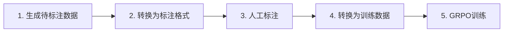

# PDF 提纲提取 - 完整训练流程

本文档详细介绍如何使用 GRPO（分组策略优化）算法训练 PDF 提纲提取模型的完整流程。

## 目录

- [概述](#概述)
- [前置要求](#前置要求)
- [流程总览](#流程总览)
- [详细步骤](#详细步骤)
- [常见问题](#常见问题)

---

## 概述

本项目的提纲提取模块采用 GRPO（Group Relative Policy Optimization）强化学习算法进行训练，通过以下数据流实现从 PDF 到高质量训练数据的转换：

```
PDF → OCR结果 → 待标注数据 → 人工标注 → 训练数据 → GRPO训练
```

---

## 前置要求

### 环境依赖

- Python 3.8+
- PyTorch
- TRL 库（用于 GRPO 训练）
- Label Studio（标注平台）

### 目录结构

确保以下目录已创建：

```
pdf_extractor/
├── sample_data/
│   └── ocr_results/              # 示例 OCR 数据
├── extractor/
│   └── outline_extractor/
│       └── logs/                 # LLM 调用日志
├── labeling/
│   └── outline/                  # 标注数据准备工具
├── labeling_data/
│   └── outline/                  # 待标注数据
├── labeled_data/
│   └── outline/                  # 人工标注结果
├── training_data_builder/
│   └── outline/                  # 训练数据构建工具
├── training_data/
│   └── outline/                  # 训练数据
└── grpo_training/
    └── outline/                  # GRPO 训练脚本
```

---

## 流程总览

完整的训练流程包含 5 个步骤：



---

## 详细步骤

### 步骤 1: 生成待标注数据

使用 OCR 工具对 PDF 处理后的结果，通过 LLM 生成待标注数据。

#### 操作步骤

```bash
# 进入提纲提取器目录
cd extractor/outline_extractor

# 使用默认示例数据运行
python main.py

# 或使用自定义数据
python main.py --input-path /path/to/ocr_results
```

#### 关键参数

- `--input-path`: OCR 结果文件路径（默认：`../../sample_data/ocr_results`）
- `--log-dir`: 日志保存目录（默认：`logs/llm_calls`，相对于 `extractor/outline_extractor/`）
- `--llm-mode`: LLM 客户端模式（`modelscope` 或 `vllm`）
- `--start` / `--end`: 处理文件范围
- `--force`: 强制重新处理所有文件

#### 输出结果

运行后会在 `extractor/outline_extractor/logs/llm_calls` 目录生成日志文件，包含：
- LLM 调用记录
- 提取的提纲候选
- 处理状态统计

#### 示例输出

```
[Main] 运行 ID: 20250211_143052
[Main] 日志目录: logs/llm_calls
[Main] 找到 1 个 JSON 文件待处理
[完成] 共处理 1 个文件
[成功] 1 个文件
[总计] 提取到 25 条提纲
```

---

### 步骤 2: 转换为标注格式

将日志文件转换为 Label Studio 可导入的标注数据格式。

#### 操作步骤

```bash
# 进入标注准备目录
cd labeling/outline

# 转换日志数据
python prepare.py --log-dir ../../extractor/outline_extractor/logs/llm_calls --output ../../labeling_data/outline
```

#### 关键参数

- `--log-dir`: 日志文件目录（来自步骤 1，位于 `extractor/outline_extractor/logs/llm_calls`）
- `--output`: 输出目录（默认：`../../labeling_data/outline`）

#### 输出结果

生成 Label Studio 可导入的 JSON 文件，包含：
- 任务 ID
- 原始文本
- 候选提纲
- OCR 元数据

---

### 步骤 3: 人工标注

在 Label Studio 平台进行人工标注，选择正确的提纲。

#### 3.1 配置 Label Studio

1. **启动 Label Studio**

```bash
label-studio start
```

2. **创建项目**

- 项目名称：`Outline Extraction`
- 标注类型：`Choice Classification`

3. **设置标注模板**

```xml
<View>
  <Text name="content" value="$content"/>
  <Header value="选择正确的提纲:"/>
  <Choices name="outline" toName="content" choice="multiple">
    <Choice value="候选1"/>
    <Choice value="候选2"/>
    <Choice value="候选3"/>
  </Choices>
</View>
```

#### 3.2 导入数据

1. 在 Label Studio 项目中点击 **Import**
2. 选择步骤 2 生成的 JSON 文件
3. 确认导入

#### 3.3 执行标注

1. 逐个检查每个任务
2. 选择正确的提纲选项
3. 提交标注结果
4. 完成所有任务

#### 3.4 导出标注结果

1. 点击 **Export**
2. 选择 **JSON** 格式
3. 下载并保存到 `labeled_data/outline/` 目录

---

### 步骤 4: 转换为训练数据

将人工标注结果转换为 GRPO 算法可用的训练数据格式。

#### 操作步骤

```bash
# 从项目根目录运行转换脚本
python training_data_builder/outline/from_labeled/convert.py \
    --input labeled_data/outline \
    --output-dir training_data/outline
```

#### 关键参数

- `--input`: 标注数据源目录（相对于项目根目录）
- `--output-dir`: 训练数据保存目录（默认：`training_data/outline`，相对于项目根目录）

#### 输出格式

生成符合 TRL GRPO 格式的训练数据（JSONL 格式，每行一个 JSON 对象）：

```json
{
  "prompt": [
    {"role": "user", "content": "完整的任务描述和输入信息..."}
  ],
  "solution": "【当前页组确认提纲】（第X-Y页）\n\n1. [一级] 提纲标题内容 (页码:行号)\n   1.1 [二级] 子标题内容 (页码:行号)\n..."
}
```

**字段说明**：
- `prompt`: 列表格式，包含用户输入的完整任务描述和候选提纲信息
- `solution`: 字符串格式，人工标注的正确提纲提取结果

#### 数据验证

转换完成后，检查：

```bash
# 查看生成的训练数据文件
ls -lh training_data/outline/*.jsonl

# 查看数据行数
wc -l training_data/outline/*.jsonl

# 验证第一条数据格式
head -1 training_data/outline/*.jsonl | python -c "import sys, json; print(json.dumps(json.loads(sys.stdin.read()), indent=2, ensure_ascii=False))"
```

**注意**：
- 训练数据为 JSONL 格式（每行一个 JSON 对象）
- 文件名格式：`trl_grpo_labeled_YYYY_MM_DD_HH_MM_SS.jsonl`
- 每行包含 `prompt`（列表）和 `solution`（字符串）两个字段

---

### 步骤 5: GRPO 训练

使用转换后的数据进行 GRPO 训练。

#### 操作步骤

```bash
# 从项目根目录执行训练脚本
sh grpo_training/outline/grpo.sh

# 或者进入训练目录执行
cd grpo_training/outline
sh grpo.sh
```

#### 训练配置

编辑 `grpo_training/outline/grpo.sh` 自定义训练参数。脚本内容示例如下：

```bash
#!/bin/bash

python -m trl.cli grpo \
  --output_dir=./grpo_training/outline/checkpoints \
  --model_name_or_path=Qwen/Qwen2.5-7B \
  --reward_model=Qwen/Qwen2.5-7B \
  --dataset_path=../../training_data/outline \
  --max_steps=1000 \
  --per_device_train_batch_size=2 \
  --gradient_accumulation_steps=8 \
  --learning_rate=1e-5 \
  --warmup_ratio=0.1 \
  --logging_steps=10 \
  --save_steps=100
```

#### 关键参数说明

| 参数 | 说明 | 推荐值 |
|------|------|--------|
| `--output_dir` | 模型保存路径 | `./checkpoints` |
| `--model_name_or_path` | 基础模型 | `Qwen/Qwen2.5-7B` |
| `--dataset_path` | 训练数据路径 | `../../training_data/outline` |
| `--max_steps` | 训练步数 | 1000-5000 |
| `--learning_rate` | 学习率 | 1e-5 - 5e-5 |
| `--per_device_train_batch_size` | 批次大小 | 2-8 |

#### 监控训练进度

```bash
# 查看 TensorBoard（如果配置）
tensorboard --logdir=grpo_training/outline/checkpoints

# 查看训练日志
tail -f grpo_training/outline/checkpoints/trainer_log.json
```

---

## 常见问题

### Q1: 步骤 1 生成的日志文件在哪里？

日志文件保存在 `extractor/outline_extractor/logs/llm_calls` 目录，文件名格式为 `RUN_ID.json`。

### Q2: 如何只处理部分文件？

使用 `--start` 和 `--end` 参数（在 `extractor/outline_extractor` 目录下执行）：

```bash
python main.py --start 0 --end 10  # 处理前 10 个文件
```

### Q3: 如何重新生成已处理的数据？

使用 `--force` 参数（在 `extractor/outline_extractor` 目录下执行）：

```bash
python main.py --force
```

### Q4: Label Studio 导出的格式不兼容？

确保导出格式为 **JSON**，而非 JSON-Min 或其他格式。

### Q5: GRPO 训练显存不足？

尝试以下方法：
- 减小 `per_device_train_batch_size`
- 增加 `gradient_accumulation_steps`
- 使用更小的模型（如 Qwen2.5-3B）

### Q6: 如何验证训练数据质量？

```bash
# 统计训练数据量（从项目根目录执行）
python -c "import json; f=open('training_data/outline/trl_grpo_labeled_2026_02_11_21_25_48.jsonl', encoding='utf-8'); lines=f.readlines(); print(f'Total samples: {len(lines)}')"

# 查看第一条样本（从项目根目录执行）
head -1 training_data/outline/*.jsonl | python -c "import sys, json; print(json.dumps(json.loads(sys.stdin.read()), indent=2, ensure_ascii=False)[:2000])"
```

---

## 最佳实践

1. **数据质量优先**
   - 小批量高质量数据 > 大量低质量数据
   - 建议每轮训练使用 100-500 条高质量标注

2. **迭代训练**
   - 每轮训练后评估模型效果
   - 根据错误样本补充训练数据
   - 逐步扩大数据规模

3. **版本管理**
   - 为每轮训练数据打标签（如 `v1.0`, `v1.1`）
   - 保留训练配置和模型检查点
   - 记录每次训练的效果对比

4. **断点续传**
   - 利用 `--start`/`--end` 分批处理
   - 检查日志避免重复调用 LLM
   - 备份中间结果

---

## 相关文档

- [Label Studio 使用指南](https://labelstud.io/guide/)
- [TRL 库 GRPO 文档](https://huggingface.co/docs/trl/main/en/grpo_trainer)
- [主 README](../README.md)

---

## 更新日志

- **2025-02-11**: 初始版本，整理完整训练流程
